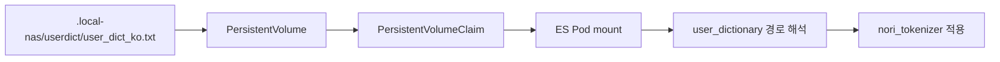

# 08. 사용자 정의 사전 가이드 📚

<!-- DOC_STYLE_GUIDE -->
> 📌 <font color="#FFD700"><b>핵심</b></font>: 이 문서는 실무 적용 기준으로 정리되었습니다.
> ⚠️ <font color="red"><b>주의</b></font>: 설정/절차를 생략하면 장애나 품질 저하가 발생할 수 있습니다.
> ✅ <font color="green"><b>권장</b></font>: 체크리스트 순서대로 실행하고 결과를 반드시 검증하세요.

이 문서는 초보 개발자와 검색 기획자가 함께 이해할 수 있도록,  
**사용자 정의 사전(user dictionary)**의 개념과 이 프로젝트 적용 방식을 설명합니다.

## 사용자 정의 사전 🚀
- 사용자 정의 사전은 "단어를 어떻게 쪼갤지(토큰화)"를 제어한다.
- 동의어는 "의미가 같은 단어를 어떻게 확장할지"를 제어한다.
- 사용자 사전 변경은 tokenizer 규칙 변경이므로 <font color="red"><b>재색인</b></font>이 필요하다.

---

## 0. 왜 필요한가? 🤔

일반 형태소 분석기는 도메인 용어를 의도와 다르게 분해할 수 있습니다.

예시:
- 검색어: `얇은피 만두`
- 기대: `얇은피`를 하나의 의미 단위로 유지
- 실제(사전 미적용): 분리되면 검색 품질이 흔들릴 수 있음

쇼핑 검색에서는 이런 작은 차이가 결과 품질(노출/정렬)에 직접 영향을 줍니다.

> [!TIP]
> 사용자 사전은 "검색 품질을 안정화하는 안전장치"입니다.
> 특히 브랜드명/상품군/고유명사에서 효과가 큽니다.

---

## 1. 개념 정리: 사용자 사전 vs 동의어 🧩

| 항목 | 사용자 정의 사전 | 동의어 |
|---|---|---|
| 목적 | 토큰화(형태소 분해 단위) 제어 | 의미 확장(같은 뜻 단어 연결) |
| 적용 위치 | tokenizer (`nori_tokenizer`) | analyzer filter (`synonym_graph`) |
| 변경 시 영향 | 보통 재색인 필요 | search-time이면 재색인 없이 반영 가능 |
| 예시 | `얇은피`, `얄피`를 고정 토큰화 | `만두, 교자, 얇은피, 얄피` 확장 |

### 한 문장 요약 🧠
- 사용자 사전은 "단어 쪼개기 규칙"
- 동의어는 "의미 묶기 규칙"

---

## 2. 이 프로젝트의 적용 방식 (PV/PVC + 파일 경로 방식) ⚙️

이 프로젝트는 Elasticsearch Nori tokenizer에 파일 경로를 연결하는 방식입니다.

### 2.1 사전 원본 파일
- 운영 active 파일:
  - `.local-nas/userdict/user_dict_ko.txt`

### 2.2 인덱스 매핑
- `src/main/resources/es/index-mapping.json`
- 핵심 설정:
  - `ko_nori_userdict_tokenizer` 정의
  - `user_dictionary: "userdict/user_dict_ko.txt"`
  - `ko_mall_analyzer`, `ko_mall_search_analyzer` tokenizer를 위 커스텀 tokenizer로 연결

#### 2.2.1 `userdict/user_dict_ko.txt`가 실제 파일 경로로 연결되는 과정

초보자가 가장 많이 헷갈리는 지점은  
`userdict/user_dict_ko.txt`가 "프로젝트 경로"가 아니라는 점입니다.

핵심 규칙:
- `user_dictionary` 값은 Elasticsearch 컨테이너의 <font color="#FFD700"><b>config 디렉터리 기준 상대경로</b></font>로 해석됩니다.

이 프로젝트 기준으로 보면:
1. 매핑에는 `user_dictionary: "userdict/user_dict_ko.txt"`를 넣는다.
2. Elasticsearch는 이 값을 `/usr/share/elasticsearch/config` 기준으로 해석한다.
3. 따라서 실제 참조 파일은  
   `/usr/share/elasticsearch/config/userdict/user_dict_ko.txt` 가 된다.
4. 그래서 ECK YAML에서 정확히 그 경로로 디렉터리를 마운트해야 한다.

### 한 줄 요약
- `userdict/user_dict_ko.txt` (상대경로)  
  -> `/usr/share/elasticsearch/config/userdict/user_dict_ko.txt` (컨테이너 실제 경로)

### 참고(공식 문서) 🔗
- https://www.elastic.co/docs/deploy-manage/deploy/self-managed/install-elasticsearch-docker-configure
- 위 문서에서 Docker 실행 시 Elasticsearch 구성 파일 기본 경로가  
  `/usr/share/elasticsearch/config/`임을 확인할 수 있습니다.


### 2.3 Kubernetes 마운트
- `sh_bin/es-cluster-custom-image.yaml`
- 마운트 핵심 설정 예시:
```yaml
apiVersion: v1
kind: PersistentVolume
spec:
  hostPath:
    path: /Users/justinpark/idea/ai_search/ai-search-gpt/.local-nas/userdict
---
apiVersion: v1
kind: PersistentVolumeClaim
...
---
      podTemplate:
        spec:
          volumes:
            - name: userdict-volume
              persistentVolumeClaim:
                claimName: ai-search-userdict-pvc
          containers:
            - name: elasticsearch
              volumeMounts:
                - name: userdict-volume
                  mountPath: /usr/share/elasticsearch/config/userdict
```
- ES Pod 내부 경로:
  - `/usr/share/elasticsearch/config/userdict/user_dict_ko.txt`

즉, 로컬 외부 파일 -> PV/PVC -> ES Pod 마운트 -> tokenizer 참조 순서로 연결됩니다.



---

## 3. 운영 흐름 (초기 1회) 🚀

번호 순서 실행 기준:
1. `./sh_bin/00_1_delete_elasticsearch_resources.sh` (필요 시)
2. `./sh_bin/00_2_install_eck_operator.sh`
3. `./sh_bin/00_3_build_elasticsearch_nori_image.sh`
4. `./sh_bin/00_4_push_elasticsearch_nori_image.sh` (필요 시)
5. `.local-nas/userdict/user_dict_ko.txt` 준비
6. `./sh_bin/00_6_start_elasticsearch_cluster_custom_image.sh`
7. `./sh_bin/00_9_check_elasticsearch_nori_plugin.sh`

포인트:
- <font color="green"><b>active 사전 파일을 준비한 뒤 `00_6`을 실행해, 처음부터 마운트 누락을 방지합니다.</b></font>

> [!IMPORTANT]
> active 사전 파일 또는 PV/PVC 마운트가 없으면 Pod 내부 사전 파일이 없어서 인덱스 생성 시 실패할 수 있습니다.

---

## 4. 운영 흐름 (사전 단어 변경 시 반복) 🔁

1. `.local-nas/userdict/user_dict_ko.txt` 수정
2. `./sh_bin/05_1_reloadUserDictionary.sh`
3. `./sh_bin/05_2_verifyUserDictionary.sh`

`05_1`이 수행:
- 외부 active 사전 파일 확인
- ES Pod 내부 마운트 파일 확인
- 재색인 + alias 전환

`05_2`가 수행:
- `_analyze` 호출
- 기대 토큰 존재 확인

### 자주 쓰는 실행 명령
```bash
./sh_bin/05_1_reloadUserDictionary.sh
./sh_bin/05_2_verifyUserDictionary.sh
```

---

## 5. 왜 재색인이 필요한가? 🔍

사용자 사전은 tokenizer 규칙입니다.  
tokenizer가 바뀌면 문서가 색인될 때 저장되는 토큰 구조도 바뀝니다.

따라서:
- 사전 변경 후 기존 문서를 그대로 두면, 검색어 토큰과 문서 토큰이 어긋날 수 있음
- 신규 인덱스 생성 + 재색인 + alias 전환이 안전한 표준 절차

> [!WARNING]
> 사용자 사전 변경은 동의어 변경과 다릅니다.  
> 동의어는 search-time 반영이 가능하지만, <font color="red"><b>사용자 사전은 재색인이 사실상 필수</b></font>입니다.

---

## 6. 검색 기획자 관점 체크포인트 ✅

기획 의사결정 시 확인할 항목:
- 어떤 단어를 "붙여서" 인식해야 하는가? (브랜드/상품군/관용어)
- 동의어로 풀지, 사용자 사전으로 고정할지 구분했는가?
- 변경 후 대표 검색어 검증 시나리오가 있는가?
  - 예: `얇은피`, `얄피`, `교자`, `만두`

실무 팁:
- 사용자 사전은 "적게, 정확하게" 운영하는 것이 좋습니다.
- 과도한 사전 등록은 예상치 못한 분석 결과를 만들 수 있습니다.

---

## 7. 개발자 관점 체크포인트 ✅

- `index-mapping.json` tokenizer 연결이 올바른가
- ES Pod 내부에 파일 마운트가 실제로 존재하는가
- 재색인 로그에서 오류 없이 alias 전환이 완료됐는가
- `_analyze` 결과에 기대 토큰이 포함되는가

---

## 8. 장애/운영 주의사항 ⚠️

- 현재 프로젝트는 단일 노드(`count: 1`) 구성입니다.
- 현재 PV/PVC 방식 검증 기준으로는 ES 재시작 없이 신규 인덱스 생성 + 재색인 + alias 전환을 우선 검토합니다.
- 트래픽이 낮은 시간대에 작업하는 것을 권장합니다.

문제 발생 시:
- alias를 직전 안정 인덱스로 롤백
- 사전/마운트/매핑 원인 확인 후 재적용

### 빠른 점검 체크
- Pod 내부 파일 존재: `/usr/share/elasticsearch/config/userdict/user_dict_ko.txt`
- `_analyze` 결과에 기대 토큰 포함 여부
- 재색인 완료 로그와 alias 전환 로그 확인

### 실패 사례 2가지(자주 발생)
1. 마운트 디렉터리 내 추가 파일 문제
- 증상: ES가 기동 중 security/file watcher 초기화 오류로 실패할 수 있음
- 원인: `config/userdict` 아래에 테스트용 추가 파일이 함께 존재하고, 특히 비 ASCII 파일명이 포함되면 문제가 발생할 수 있음
- 해결: active 파일 외 추가 파일은 두지 않거나, 반드시 ASCII 파일명만 사용한다.

2. 재색인 누락
- 증상: `_analyze`는 기대 토큰이 나오는데 검색 결과는 변경 전과 유사함
- 원인: tokenizer 변경 후 기존 문서 토큰이 갱신되지 않음
- 해결: `05_1_reloadUserDictionary.sh`로 재색인 + alias 전환까지 수행

---

## 9. OOP 관점에서의 적용 원칙 🧱

- SRP:
  - 사전 데이터: `.local-nas/userdict/user_dict_ko.txt`
  - 인덱스 분석 설정: `index-mapping.json`
  - 롤아웃 실행: `IndexRolloutService`
- OCP:
  - 검색 API 계층은 변경 없이 analyzer/lifecycle 계층에서 확장
- DIP:
  - 상위 오케스트레이션은 구체 구현보다 "설정/실행 책임 분리"를 유지

결론:
- 사용자 사전은 "검색 API 로직 수정"이 아니라,  
  "분석기 설정 + 운영 절차"로 관리하는 것이 유지보수에 유리합니다.

---

## 10. 한 줄 결론 📝

이 프로젝트에서 사용자 정의 사전은  
**파일 기반으로 관리하고, 번호 순 스크립트로 반영하며, 재색인/검증까지 표준화해서 운영**합니다.
